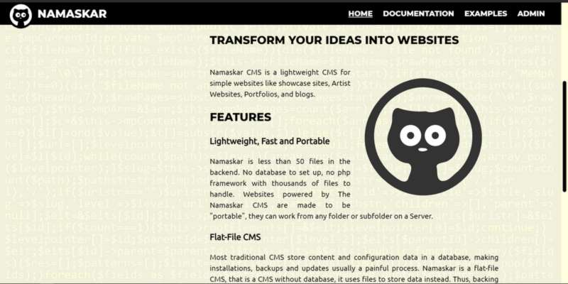
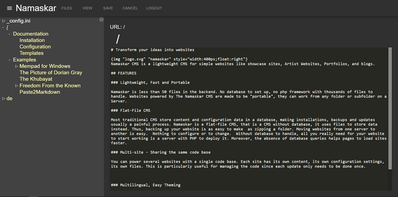

This is the **old** version from 2019... 
I keep it here as a souvenir... ^^
Go and see the latest version here:
https://github.com/qwwwest/namaskar-cms

TRANSFORM YOUR IDEAS INTO WEBSITES
==================================
 
Namaskar CMS is a lightweight CMS for simple websites like showcase sites, Artist Websites, Portfolios, and blogs.

demo available at [http://qwwwest.com/namaskar](http://qwwwest.com/namaskar)
backend admin login: **demo** and password: **demo** 
(but it is *read only* in demo mode ^^ )

FEATURES
--------

### Lightweight, Fast and Portable

Namaskar is less than 50 files in the backend. No database to set up, no php framework with thousands of files to handle. Websites powered by The Namaskar CMS are made to be "portable", they can work from any folder or subfolder on a Server.

### Flat-File CMS

Most traditional CMS store content and configuration data in a database, making installations, backups and updates usually a painful process. Namaskar is a flat-file CMS, that is a CMS without database, it uses files to store data instead. Thus, backing up your website is as easy to make as zipping a folder. Moving websites from one server to another is easy. Nothing to configure or to change. Without database to handle, all you really need for your website to start working is a server with PHP to deploy it. Moreover, the absence of database queries helps pages to load sites faster.

### Multi-site - Sharing the same code base

You can power several websites with a single code base. Each site has its own content, its own configuration settings, its own files. This is particularly useful for managing the code since each update only needs to be done once.

### Multilingual, Easy Theming

It is possible to have a mutiligual version of your site out of the box. Creating and modifying a theme is simple,\
because being minimalistic, you can use your creativity to do whatever you want with your HTML/CSS and JavaScript skills.

